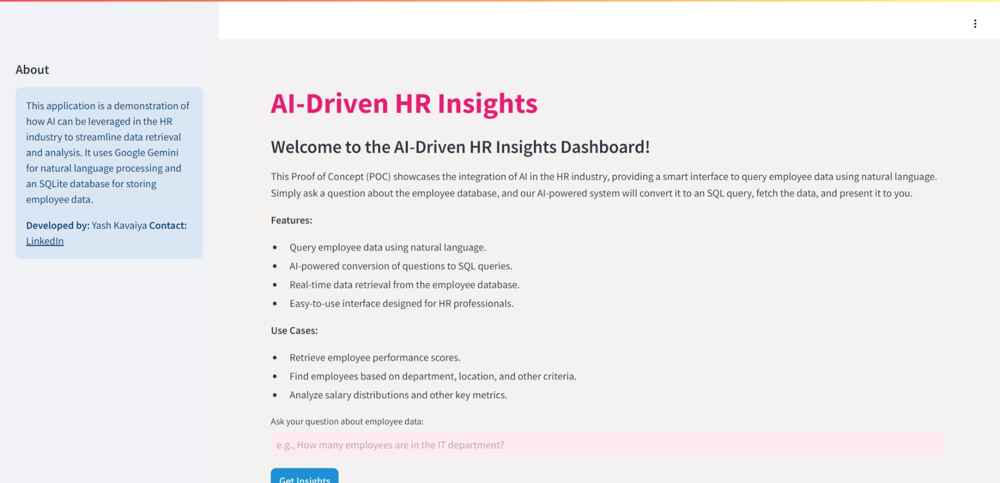

# 𝗧𝗿𝗮𝗻𝘀𝗳𝗼𝗿𝗺𝗶𝗻𝗴 𝗛𝗥 𝗤𝘂𝗲𝗿𝘆 𝗠𝗮𝗻𝗮𝗴𝗲𝗺𝗲𝗻𝘁 𝘄𝗶𝘁𝗵 𝗔𝗜

This project is a Proof of Concept (POC) that demonstrates the integration of AI in the HR industry. The application provides a smart interface to query employee data using natural language. By leveraging Google Gemini for natural language processing and an SQLite database for data storage, this app showcases how AI can streamline data retrieval and analysis for HR professionals.



Demo link :- https://huggingface.co/spaces/yashkavaiya/HR-Insights
Video Demo :- https://youtu.be/GN_zE5FG-oo?si=LkEOYVyotTVBV6zn

## Features

- Query employee data using natural language.
- AI-powered conversion of questions to SQL queries.
- Real-time data retrieval from the employee database.
- Easy-to-use interface designed for HR professionals.

## Use Cases

- Retrieve employee performance scores.
- Find employees based on department, location, and other criteria.
- Analyze salary distributions and other key metrics.

## Tech Stack

- **Python**: Programming language used for development.
- **Streamlit**: Framework for building the web application.
- **SQLite**: Database used for storing employee data.
- **Google Gemini**: Used for natural language processing.
- **Faker**: Library for generating dummy data.

## Installation

1. **Clone the repository:**

    ```bash
    git clone https://github.com/your-repository/ai-hr-insights.git
    cd ai-hr-insights
    ```

2. **Create a virtual environment and activate it:**

    ```bash
    python -m venv venv
    source venv/bin/activate  # On Windows, use `venv\Scripts\activate`
    ```

3. **Install the required packages:**

    ```bash
    pip install -r requirements.txt
    ```

4. **Set up environment variables:**

    Create a `.env` file in the root directory and add your Google API key:

    ```env
    GOOGLE_API_KEY=your_google_api_key
    ```

5. **Run the application:**

    ```bash
    streamlit run app.py
    ```

## Usage

1. **Open the application:**

    Once the application is running, open your web browser and go to `http://localhost:8501`.

2. **Ask a question:**

    Enter a question about the employee data in the input field. For example, "How many employees are in the IT department?".

3. **Get Insights:**

    Click the "Get Insights" button to see the generated SQL query and the results retrieved from the database.

## Database Setup

```bash
python Create_db.py
```

## Contributing

Feel free to fork the repository and submit pull requests. For major changes, please open an issue first to discuss what you would like to change.

## Other useful resources :-

https://medium.com/@yash.kavaiya3/streamlining-your-streamlit-app-deployment-with-docker-0f6aff7bce48


## License

This project is licensed under the MIT License. See the [LICENSE](LICENSE) file for more details.

## Contact

**Developer:** Yash Kavaiya  
**LinkedIn:** [Yash Kavaiya](https://www.linkedin.com/in/yashkavaiya/)
