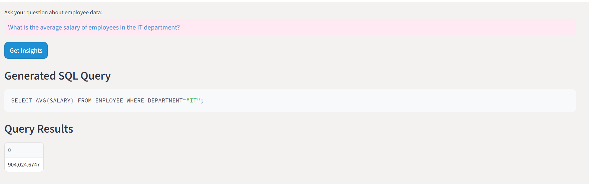
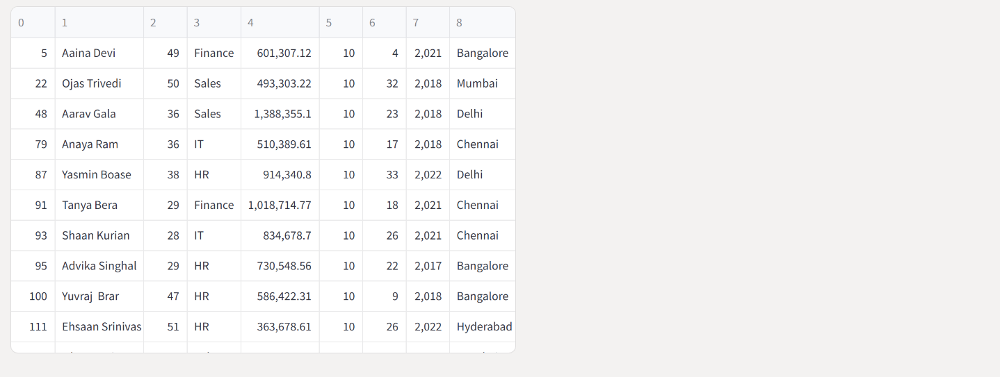
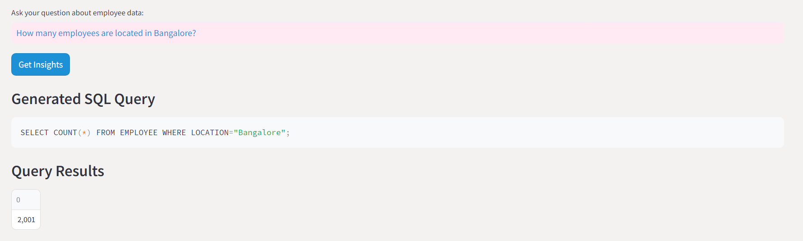
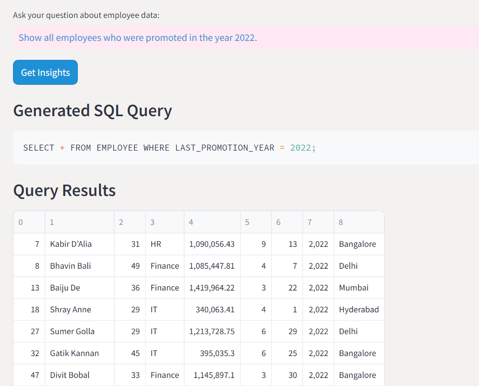
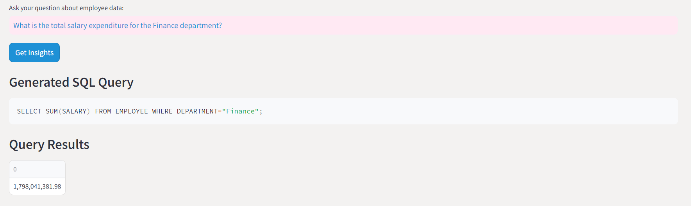
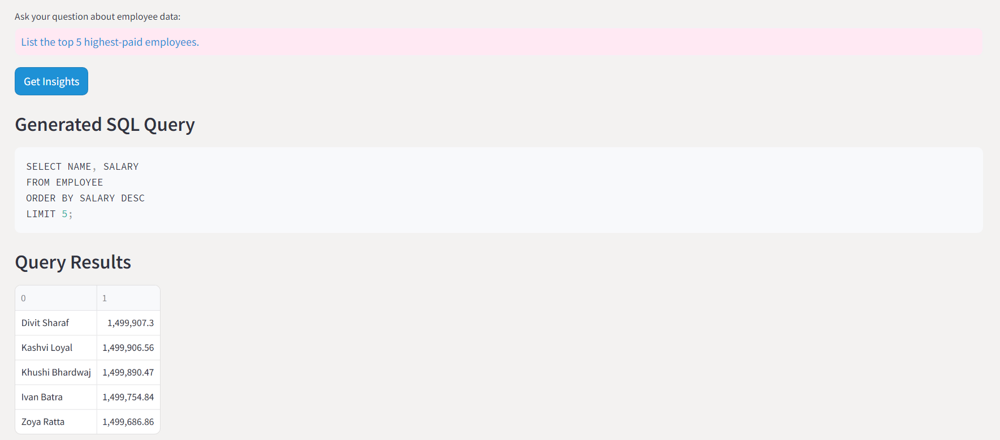
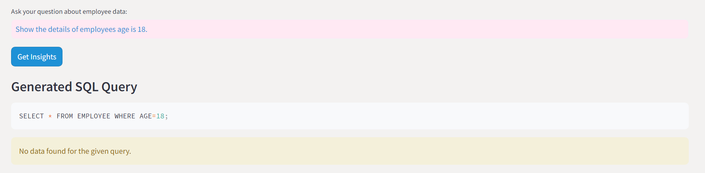
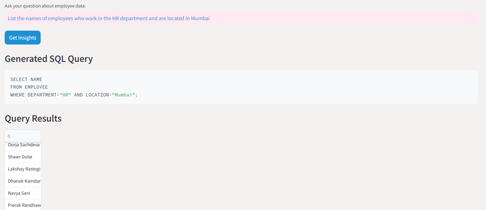

## Test Cases

## Test Questions

### 1. How many employees are there in the company?
**Question**: How many employees are there in the company?  
**Expected SQL Query**: `SELECT COUNT(*) FROM EMPLOYEE;`  
**Expected Result**: The total count of employees in the `EMPLOYEE` table.


### 2. What is the average salary of employees in the IT department?
**Question**: What is the average salary of employees in the IT department?  
**Expected SQL Query**: `SELECT AVG(salary) FROM EMPLOYEE WHERE department='IT';`  
**Expected Result**: The average salary of employees in the IT department.



### 3. List all employees who have a performance score of 10.
**Question**: List all employees who have a performance score of 10.  
**Expected SQL Query**: `SELECT * FROM EMPLOYEE WHERE performance_score=10;`  
**Expected Result**: A table listing all employees with a performance score of 10.



### 4. How many employees are located in Bangalore?
**Question**: How many employees are located in Bangalore?  
**Expected SQL Query**: `SELECT COUNT(*) FROM EMPLOYEE WHERE location='Bangalore';`  
**Expected Result**: The count of employees located in Bangalore.



### 5. Show all employees who were promoted in the year 2022.
**Question**: Show all employees who were promoted in the year 2022.  
**Expected SQL Query**: `SELECT * FROM EMPLOYEE WHERE last_promotion_year=2022;`  
**Expected Result**: A table listing all employees promoted in 2022.



### 6. What is the total salary expenditure for the Finance department?
**Question**: What is the total salary expenditure for the Finance department?  
**Expected SQL Query**: `SELECT SUM(salary) FROM EMPLOYEE WHERE department='Finance';`  
**Expected Result**: The total salary expenditure for employees in the Finance department.



### 7. List the top 5 highest-paid employees.
**Question**: List the top 5 highest-paid employees.  
**Expected SQL Query**: `SELECT * FROM EMPLOYEE ORDER BY salary DESC LIMIT 5;`  
**Expected Result**: A table listing the top 5 highest-paid employees.



### 8. How many employees have more than 10 years of experience?
**Question**: How many employees have more than 20 years of experience?  
**Expected SQL Query**: `SELECT COUNT(*) FROM EMPLOYEE WHERE years_of_experience > 10;`  
**Expected Result**: The count of employees with more than 10 years of experience.


### 9. Show the details of employees age 18.
**Question**: Show the details of employees aged between 30 and 40.  
**Expected SQL Query**: `SELECT * FROM EMPLOYEE WHERE age BETWEEN 30 AND 40;`  
**Expected Result**: A table listing all employees aged between 30 and 40.


### 10. List the names of employees who work in the HR department and are located in Mumbai.
**Question**: List the names of employees who work in the HR department and are located in Mumbai.  
**Expected SQL Query**: `SELECT name FROM EMPLOYEE WHERE department='HR' AND location='Mumbai';`  
**Expected Result**: A table listing the names of employees who work in the HR department and are located in Mumbai.




### 1. Application Launch
**Test ID**: TC001  
**Description**: Verify that the Streamlit application launches without errors.  
**Steps**:
1. Run the Streamlit application.
   ```sh
   streamlit run app.py
   ```
2. Verify that the application loads in the browser.

**Expected Result**: The application should launch and display the title "Gemini SQL Query Retriever" with no errors.

### 2. UI Elements Presence
**Test ID**: TC002  
**Description**: Verify that all UI elements are present on the main page.  
**Steps**:
1. Launch the Streamlit application.
2. Check for the presence of the following elements:
   - Title "Gemini SQL Query Retriever"
   - Description text
   - Text input for the question
   - Submit button
   - Placeholder for displaying SQL query
   - Placeholder for displaying query results

**Expected Result**: All specified UI elements should be present and correctly displayed.

### 3. Submit Valid Question
**Test ID**: TC003  
**Description**: Verify that submitting a valid question returns the correct SQL query and results.  
**Steps**:
1. Enter a valid question in the text input, e.g., "How many entries of records are present?"
2. Click the "Submit" button.

**Expected Result**: The generated SQL query should be displayed, and the query results should be shown in a table format.

### 4. Submit Invalid Question
**Test ID**: TC004  
**Description**: Verify that submitting an invalid question returns an appropriate error message.  
**Steps**:
1. Enter an invalid question in the text input, e.g., "What is the color of the sky?"
2. Click the "Submit" button.

**Expected Result**: An error message should be displayed indicating that the query could not be processed.

### 5. SQL Query Display
**Test ID**: TC005  
**Description**: Verify that the generated SQL query is displayed correctly.  
**Steps**:
1. Enter a valid question in the text input, e.g., "Tell me all the employees in the IT department?"
2. Click the "Submit" button.

**Expected Result**: The generated SQL query should be displayed in a code block format.

### 6. Query Results Display
**Test ID**: TC006  
**Description**: Verify that the query results are displayed correctly in a table format.  
**Steps**:
1. Enter a valid question in the text input, e.g., "Tell me all the employees in the IT department?"
2. Click the "Submit" button.

**Expected Result**: The query results should be displayed in a table format with appropriate columns and data.

### 7. Loading Spinner
**Test ID**: TC007  
**Description**: Verify that a loading spinner is displayed while the query is being processed.  
**Steps**:
1. Enter a valid question in the text input.
2. Click the "Submit" button.

**Expected Result**: A loading spinner should be displayed while the query is being processed, and it should disappear once the results are shown.

### 8. Error Handling
**Test ID**: TC008  
**Description**: Verify that errors are handled gracefully and appropriate messages are displayed.  
**Steps**:
1. Modify the database connection string to an invalid path.
2. Enter a valid question in the text input.
3. Click the "Submit" button.

**Expected Result**: An error message should be displayed indicating that the database could not be accessed.

### 9. Environment Variable Check
**Test ID**: TC009  
**Description**: Verify that the application correctly loads the environment variable for the API key.  
**Steps**:
1. Ensure the `.env` file contains the correct `GOOGLE_API_KEY`.
2. Run the Streamlit application.

**Expected Result**: The application should load without any errors related to the API key, and the key should be used for generating SQL queries.

## Summary
This document provides a comprehensive set of test cases to ensure that the Gemini SQL Query Retriever application functions correctly and provides a good user experience. Each test case should be executed, and the results should be recorded to verify the application's functionality.