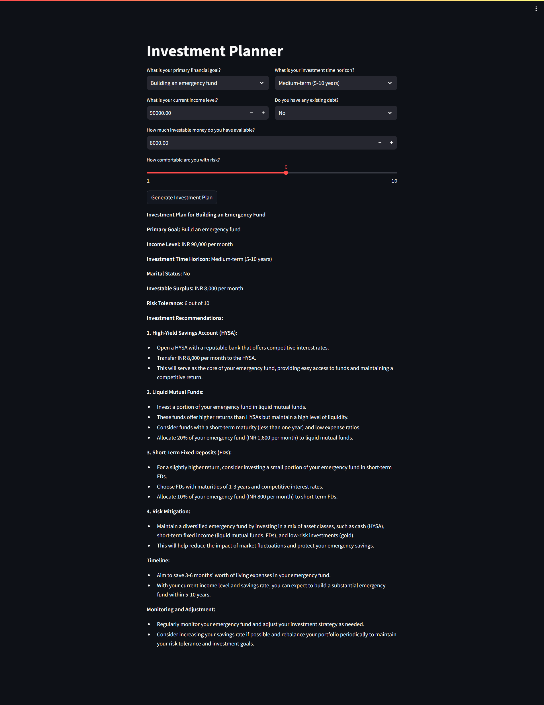

# Investment Planner

This is a Streamlit web application designed to assist users in generating an investment plan tailored to their financial goals, risk tolerance, and current financial situation. 

## Problem Statement

Investing can be a daunting task for many individuals due to the complexity of financial markets, varying investment options, and the uncertainty involved. Moreover, without a clear understanding of one's financial goals and risk tolerance, it's challenging to devise an effective investment strategy.

## Solution

The Investment Planner aims to simplify the investment process by providing personalized investment recommendations based on user input. Here's how it works:

1. **User Input**: Users provide information about their primary financial goal, current income level, investment time horizon, existing debt status, investable money available, and risk comfort level through an intuitive user interface.

2. **Data Processing**: The application processes the user input to understand their financial situation, risk appetite, and investment preferences.

3. **Algorithmic Recommendation**: Utilizing advanced algorithms and financial models, the application generates an investment plan tailored to the user's specific requirements and objectives.

## Key Features

- **Personalization**: The investment plan is customized based on the user's unique financial circumstances and goals.
  
- **Risk Management**: Users can indicate their risk tolerance, allowing the application to recommend investment options aligned with their comfort level.

- **Transparency**: The JSON output provides transparent insights into the recommended investment strategy, empowering users to make informed decisions.

- **Accessibility**: The user-friendly interface makes it easy for individuals with varying levels of financial literacy to utilize the application effectively.
