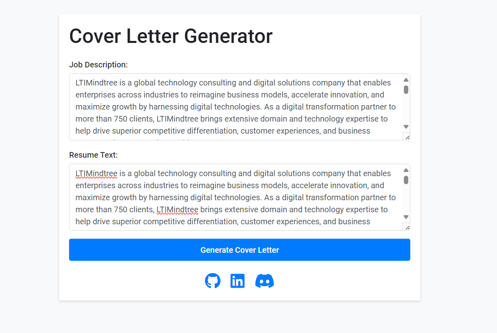

# Cover Letter Generator 
This project is a **Cover Letter Generator** built using Flask, a lightweight WSGI web application framework. The primary purpose of this application is to automatically generate personalized cover letters for job applications based on provided job descriptions and resume text. 

## Tech Stack

| Technology        | Description                                                               | Pros                                                             | Cons                                                                    |
|-------------------|---------------------------------------------------------------------------|------------------------------------------------------------------|-------------------------------------------------------------------------|
| Flask             | A micro web framework written in Python                                    | - Lightweight and easy to use                                   | - Limited functionality compared to larger frameworks                  |
| Gunicorn          | A Python WSGI HTTP Server for UNIX                                        | - Efficient and scalable for handling HTTP requests               | - Requires additional setup for deployment                                |
| Google Cloud Run | A fully managed compute platform that automatically scales your container | - Easy deployment and scaling                                   | - Limited to containerized applications                                   |
| Vertex AI         | A managed machine learning service from Google Cloud                       | - Simplifies machine learning model deployment                   | - Might be overkill for simple applications                              |

## Deployment

The application is deployed using Google Cloud Run, taking advantage of its simplicity and scalability for containerized applications. By containerizing the Flask application and deploying it to Cloud Run, we ensure seamless scaling and high availability without managing infrastructure.

### Deployment Steps

1. **Containerize Application**: Dockerize the Flask application along with necessary dependencies.

2. **Push Container to Container Registry**: Push the Docker image to Google Container Registry to make it available for deployment.

3. **Deploy to Cloud Run**: Deploy the containerized application to Cloud Run using the `gcloud` command-line tool or through the Google Cloud Console.

4. **Access Application**: Once deployed, the application will be accessible via the provided URL.

## How to Use

1. Access the web application via the provided URL.
2. Enter the job description and your resume text in the provided text areas.
3. Click on the "Generate Cover Letter" button to generate a personalized cover letter.
4. View the generated cover letter on the result page.

## Credits

This project was created by Yash Kavaiya. You can find more of their work on [GitHub](https://github.com/Yash-Kavaiya) and [LinkedIn](https://www.linkedin.com/in/yashkavaiya).

For any inquiries or issues, please contact [Your Email Address].

---

Feel free to enhance this README with additional information or customization specific to your project and deployment environment.